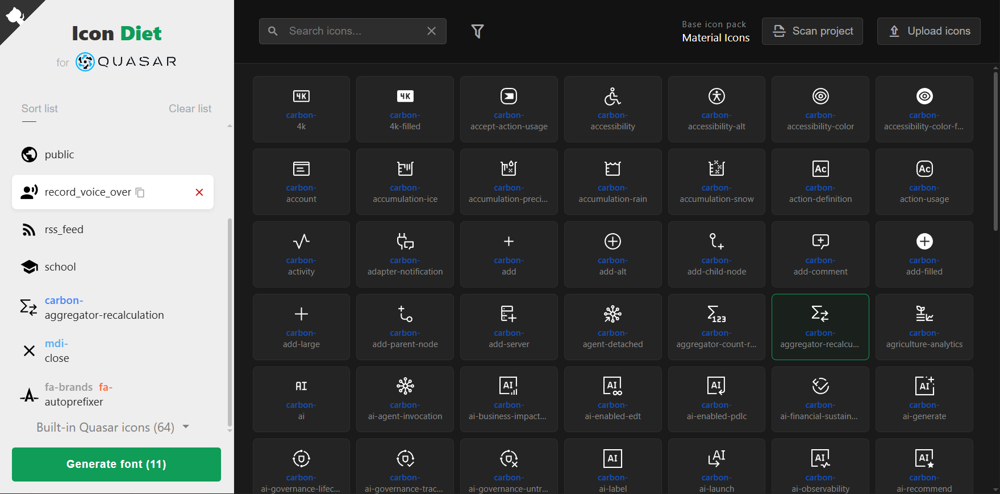
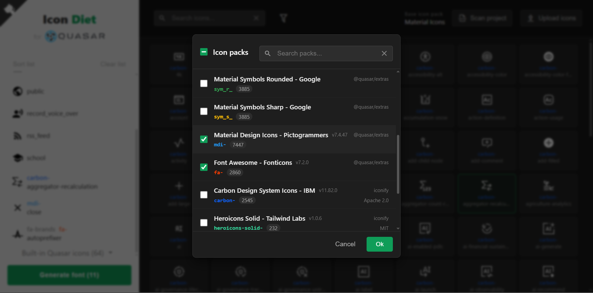

# Intro
**Icon Diet** for Quasar v2 - forces your heavy icon fonts to lose weight. In Quasar projects, unused icon packs can sometimes end up weighing more than your entire application logic combined. Result achieved on a live project: instead of 1.6 MB of fonts and 500 KB of companion CSS files — I get just 30 KB in a single CSS file!

# How It Works (No Magic)
The app doesn't require you to rewrite existing components or change syntax like `<q-icon name="..." />` or `icon="..."` (which is usually a huge pain when migrating to raw SVGs). It simply injects a lightweight boot file that hooks up a compact custom web font and overrides the icon mapping logic under the hood.

# Features
- **2 deployment options** (monorepo): can be used as a standalone local utility or integrated as a native Quasar App Extension (AE).
- **GUI Font Builder**: a clean browser interface to build your custom set by choosing icons from a pre-cached database (popular packs) or dropping in your own custom SVG files.
- **On-Demand Project Scanner**: instantly scans your `.ts`, `.js`, and `.vue` files to automatically detect used icon strings (excluding dynamic runtime strings).
- **CLI Automation** (in Quasar AE mode): the local server quietly spins up in the background when you add new icons, updates the required files, and immediately shuts down to save resources.

# Under the Hood
- Node.js backend for the local environment coupled with a lightweight, dependency-free Vanilla JS GUI.
- A normalized JSON database of SVG paths gathered from `@quasar/extras` and `Iconify` (specifically tailored for **solid/fill** geometries).
- Battle-tested compiler core: powered by robust tools like `svg2ttf`, `svgicons2svgfont`, `svgpath`, and `ttf2woff2`.
- A pinch of custom glue code.

# Installation & Setup
## Option 1: Quasar App Extension (Recommended)
```bash
quasar ext add icon-diet
```
The extension's boot file will disable previously connected fonts on the fly, but it is still highly recommended to manually comment them out in your `quasar.config.js/.ts` file inside the `extras` section.

```bash
quasar run icon-diet start
```
Upon the first launch, the app will automatically create an `idiet` folder inside your `src` root, scan the project, compile your optimized icon font, and set up the mapping.

## Option 2: Standalone Local Utility
### Install
```bash
git clone https://github.com/CCTVcalc/icon-diet
cd icon-diet
npm i
npm start
```
Open the provided link in your browser, build your custom icon set, and download the generated font package. Inside the archive, you will find a `readme.txt` — a step-by-step guide for manual integration into your Quasar project.

### Update
Inside the `icon-diet` folder:
```bash
git pull
npm i
```

# FAQ
Q: I'm using raw SVG imports. Why do I need this extension?
A: You probably don't! Manual SVG imports work totally fine in all components, and a slightly bloated DOM never killed anyone.

Q: There are way more icon packs available in `Iconify` and `@quasar/extras`. Why are they missing here?
A: Only packs that use **solid fills** (`fill`) are supported. Fonts that are partially or fully drawn with lines (`stroke`) are processed incorrectly by the current compiler stack, which often turns icons into unreadable blobs or solid black squares.

Q: Which icon packs are supported?
A: Supported out of the box are **Material Icons**, **Material Symbols**, **MDI v7**, and **Font Awesome v7**. Additionally, other packs can be used, although they cannot be configured as the default system-wide Quasar icon set (via `iconSet`): **Carbon Design System Icons**, **Heroicons Solid**, **Octicons**, **Pixelarticons**, and **Remix Icon**. Custom SVG icon uploads are also supported.

Q: What is the `<mat>` prefix for Material Icons?
A: Quasar uses no prefix for base Material Icons and short prefixes like `o_` for styles (e.g., `Outlined`). Internally and in output CSS classes, this app uses normalized prefixes such as `mat`, `mat_o`, etc., to identify Material Icon packs correctly.

Q: Why do I see nothing instead of my two icons in one tag?
A: If you list multiple non-prefixed icon names together — like `dsadadas_warning_font_download_today_ssadasd` — you might actually see 4 icons instead. Unfortunately, this app does not officially support such advanced features.

Q: Why does the code look... well, a bit "unique"?
A: Hey, it seems to work! I’m a self-taught frontend-developer with exactly zero days of commercial coding experience. The entire project was built with assistance from AI (free Google Gemini). If this tool actually becomes popular, I fully expect (and hope) the code will eventually be rewritten by pros. Pull requests, code reviews, and architectural suggestions are highly welcome! 

# License
This project is licensed under the [MIT License](LICENSE).

# Screenshots
<table>
  <tr style="border: none;">
    <td width="45%" align="center" style="border: none;">
      <a href=".github/assets/ss1.png" target="_blank">
        
      </a>
    </td>
    <td width="45%" align="center" style="border: none;">
      <a href=".github/assets/ss2.png" target="_blank">
        
      </a>
    </td>
  </tr>
</table>
